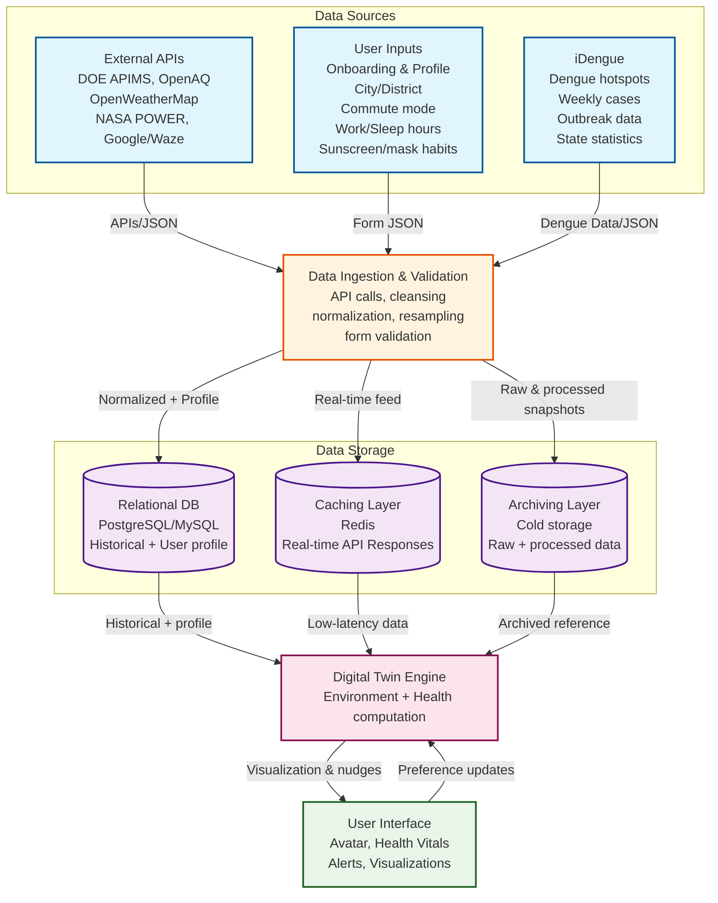

# System Architecture Diagram

## Data Flow Description

### Input Sources:
1. **External APIs**: Environmental data from various sources (air quality, weather, traffic)
2. **User Inputs**: Personal profile and preferences from users
3. **iDengue**: Dengue fever data including hotspots, weekly cases, and outbreak statistics

### Processing Pipeline:
- **Data Ingestion & Validation**: Central processing unit that cleans, normalizes, and validates all incoming data

### Storage Architecture:
- **Relational DB**: Stores historical data and user profiles
- **Caching Layer**: Provides real-time data with low latency
- **Archiving Layer**: Long-term storage for raw and processed data

### Core Engine:
- **Digital Twin Engine**: Performs environment and health computations using all available data sources

### User Interface:
- **User Interface**: Displays visualizations, health vitals, alerts, and receives user preference updates

## Key Benefits of Adding iDengue:
- **Health Risk Assessment**: Integrates dengue outbreak data for location-based health alerts
- **Comprehensive Health Monitoring**: Combines environmental and disease data for better health insights
- **Proactive Alerts**: Can warn users about dengue hotspots in their area
- **Data-Driven Decisions**: Provides historical dengue data for trend analysis
